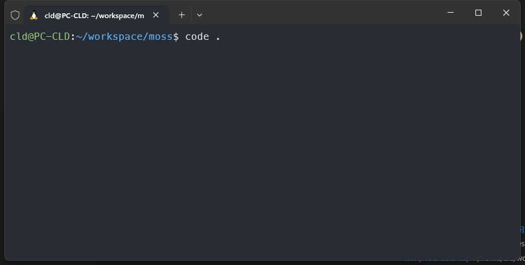
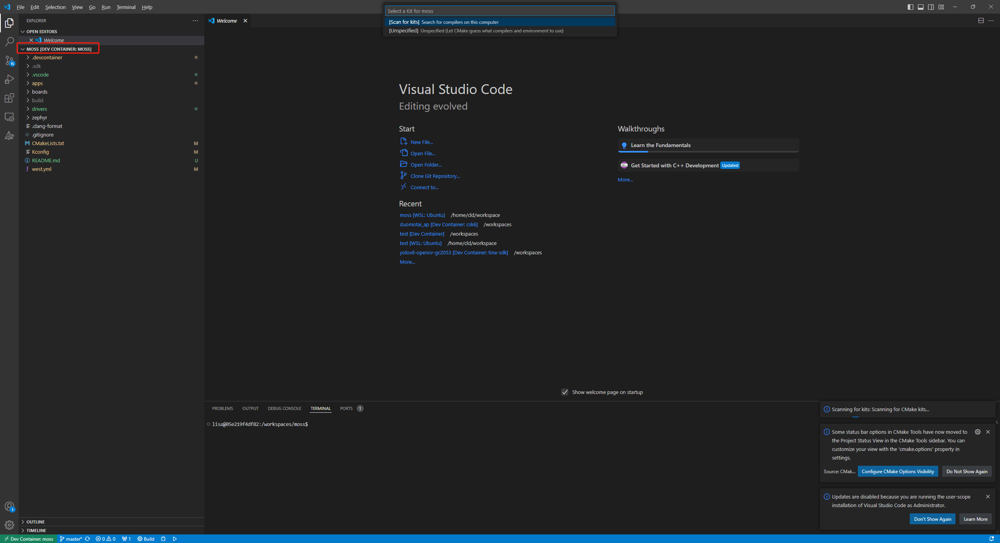

## 环境搭建

### 本地主机开发环境

请参考聆思文档中心的[环境搭建](https://docs2.listenai.com/x/ZgVUIzY6M)

### 容器开发环境（推荐）

#### 前置条件

- 必须安装[Visual Studio Code](https://code.visualstudio.com/)作为IDE
- 必须安装[Docker](https://www.docker.com/products/docker-desktop/)
- 强烈建议Windows用户使用[WSL2](https://learn.microsoft.com/zh-cn/windows/wsl/)作为Docker的基础引擎（win11已经预装）

#### 启动开发环境

**注意：** Windows用户如果使用WSL2，务必WSL2中克隆本仓库。能显著提升编译速度。

在 `moss` 目录下，执行命令

``` bash
code .
```


这时会启动 Visual Studio Code  


然后会在右下角看到`Reopen in Container`的提示按钮，点击即可进入开发环境。  
其他提示都可以忽略。  
第一次启动容器需要从[Docker Hub](https://hub.docker.com/r/listenai/csk6)拉取容器镜像, 需要一定时间.



## 开始使用

在 `moss` 目录下，执行命令

### 使用lisa初始化工程

``` bash
lisa zep init-app
```

### 编译

全量编译apps目录下的fd应用

``` bash
lisa zep build --board moss --pristine apps/fd
```

编译产物位置为`moss`目录下的:

``` bash
build/zephyr/zephyr.bin
```

**如果是容器开发环境请在vscode中右键下载**


### 烧录

- 下载并安装[cskburn 桌面烧录工具](https://docs2.listenai.com/x/oo2_KzYFd)
- 如果是使用`CP210x USB to UART`，需要下载并安装[相应驱动](https://www.silabs.com/developers/usb-to-uart-bridge-vcp-drivers?tab=downloads)